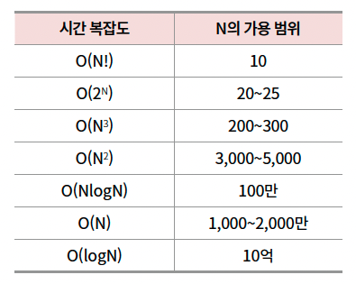
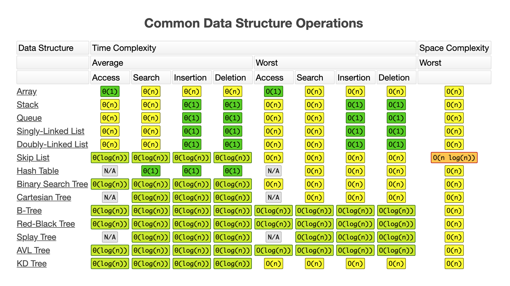

# 알고리즘을 위한 기본 수학

## 계산 횟수 예측하기

일반적인 컴퓨터의 연산 속도는 초당 10억번

### 선형 시간

- O(n) : 입력값이 n개일 때, 계산 횟수가 n배로 증가
  일반적으로 나올 수 있는 모든 패턴을 확인하는 방법

### 로그 시간

- O(log n) : 계산 횟수가 로그 n에 비례
- 이진 탐색 알고리즘

### 이차 시간

- O(n^2) : 계산 횟수가 n^2에 비례
- 선택 정렬 알고리즘

### 비교

> 이거는 코딩 테스트 테크닉으로 생각하면 편함.
> N에 대한 범위로 알고리즘을 떠올리자.




## 알고리즘에 필요한 수학

### 소수

1과 자기 자신만을 약수로 가지는 수
그렇지 않은 2 이상의 정수를 합성수라고 함.

#### 최소 공배수

두 수의 공배수 중 가장 작은 수

> a x b = (a와 b의 최대 공약수) x (a와 b의 최소 공배수) -> a x b / gcd(a, b)

#### 최대 공약수

두 수의 약수 중 가장 큰 수

> 유클리드 호제법 = a % b = r, b % r = r, r = 0 이면 b가 최대 공약수

```javascript
function gcd(a, b) {
  if (b === 0) {
    return a;
  }
  return gcd(b, a % b);
}

function lcm(a, b) {
  return (a * b) / gcd(a, b);
}
```

## 필요조건과 충분조건

어떤 조건 X를 만족하기 위해서, 반드시 조건 A를 만족해야 하면 "조건 A는 조건 X의 필요조건이다"라고 함.
반대로 조건 A만 충족하면, 조건 X가 충족될 때 "조건 A는 조건 X의 충분조건이다"라고 함.
